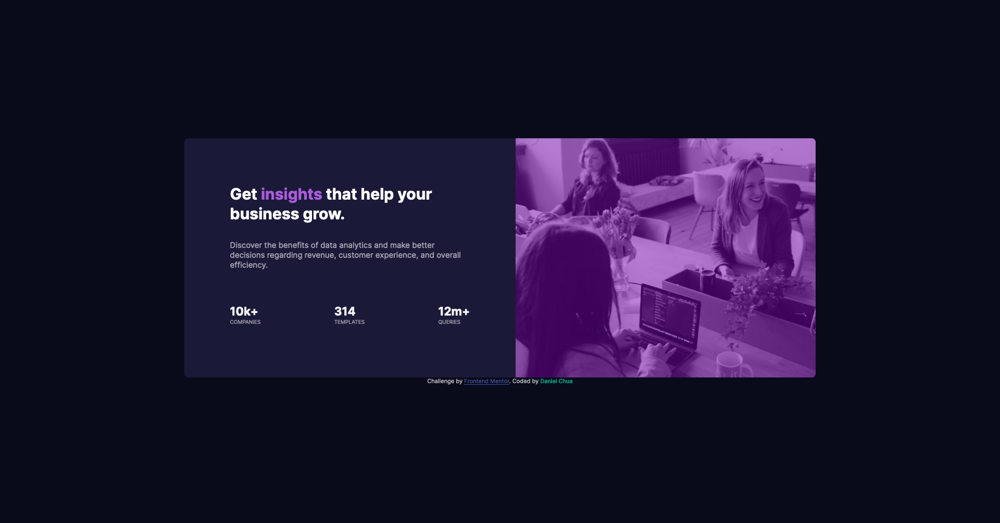

# Frontend Mentor - Stats preview card component solution by dchua-ch

Hi all, this is the first project I've built using HTML and CSS. This project is a solution to the [Stats preview card component challenge on Frontend Mentor](https://www.frontendmentor.io/challenges/stats-preview-card-component-8JqbgoU62). [Frontend Mentor](https://www.frontendmentor.io/solutions) is a site which helps people who are trying to develop Frontend development skills by providing them with designs to implement in HTML, CSS and JavaScript. 
  
The design I've implemented is a stat card consisting of an image and some text. The main challenge was to make the design responsive to different screen sizes. This was achieved using CSS Flexbox. Through this challenge, I also managed to practice some basic layout and styling skills as well as using Git and Github to manage the version control of the project.

You can check out the project [here](https://dchua-ch.github.io/Stats-preview-card/). Any feedback is appreciated :) 


## Table of contents

- [Frontend Mentor - Stats preview card component solution by dchua-ch](#frontend-mentor---stats-preview-card-component-solution-by-dchua-ch)
  - [Table of contents](#table-of-contents)
  - [Overview](#overview)
    - [The challenge](#the-challenge)
    - [Solution Screenshot](#solution-screenshot)
    - [Links](#links)
  - [My process](#my-process)
    - [Built with](#built-with)
    - [What I learned](#what-i-learned)
    - [Continued development](#continued-development)
    - [Useful resources](#useful-resources)


## Overview

### The challenge

Users should be able to:

- View the optimal layout depending on their device's screen size

### Solution Screenshot
  
*Mobile layout of stats preview card*



*Desktop layout of stats preview card*


### Links
- Live Site URL: (https://dchua-ch.github.io/Stats-preview-card/)
- Github Repo: (https://github.com/dchua-ch/Stats-preview-card)

## My process
I marked up and styled the mobile layout first. The mobile layout consists of an image and a div with text wrapped in a containing flexbox div, with class ".flex-container". The desktop layout was implemented by using a media query and changing the flex-direction.  

### Built with
- CSS custom properties
- Flexbox
- Mobile-first workflow

### What I learned
As mentioned earlier, this is my first time I've implemented a design in HTML/CSS. As such, I've managed to learn and practice many of the basics for the first time. It is also my first time using Git and GitHub to manage the version control of a project.  

I struggled with getting some parts of the design correct. Most notably the positioning of the elements. I highlight some of the challenges I overcame below.

1. #### Responsive layout using FlexBox
   The responsive layout was achieved by changing the flex-direction from column in mobile mode to row-reverse in desktop mode.
```css
.flex-container {
    /* For mobile layout */
    display: flex;
    flex-wrap: nowrap; 
    flex-direction: column;
    align-items: center;
    justify-content: center;
    width:70%;
    min-width: var(--mobile-min-width);
}

@media screen and (min-width: 922px){
    .flex-container{
      /* For desktop layout */
        flex-direction: row-reverse;
        width: 100%;
    }
    ...
```
Note that .flex-container is a div which wraps the image and the text-containing div. I found it difficult to decide on the appropriate minimum width for the desktop layout. I decided on 922px after playing around with the site in FireFox's Responsive Design Mode. The design looks decent to me on most mobile, tablet and desktop screen sizes.

1. #### Fixing image height to text-container height in desktop mode
   One issue I had with the desktop layout was fixing the image height to the height of the text-containing div. This is because I wanted the text container to have padding for its content. However, the padding added to the height of the text-container. I solved this problem by defining CSS variables for the padding and height. I then calculated the height of the image using height + padding * 2 as shown below.
```css
/* Within media query */
.img-div {
     /* Calculate height to make .img-div and img same height as .text-container */
     height: calc(var(--desktop-element-height) + var(--desktop-text-container-padding)*2);
     width: var(--desktop-element-width);
     border-radius: 0 var(--corner-radius) var(--corner-radius) 0;
 }

 .text-container{
     height: var(--desktop-element-height);;
     width: var(--desktop-element-width);
     text-align: left;
     padding: var(--desktop-text-container-padding);
     border-radius: var(--corner-radius) 0 0 var(--corner-radius);
 }
 ```
 There is probably better way to solve or avoid this issue in the future.

1. #### Preserving aspect ratio of image when window is resized
   Another issue I had was preserving the aspect ratio of the image for different window or screen sizes. For an inline image on a webpage, the image can simply resize together with the screen while preserving the aspect ratio. However, in this case, the height (width) of the image has to match the height (width) of the text container in mobile (desktop) mode. In the end, I decided to set the object-fit property of the image to "cover". This would simply crop the image when it is resized while preserving aspect ratio. I'm not sure whether there's a better approach to doing this though!  
   ```css
   img {
    width:100%;
    height: 100%;
    /* Use object-fit: cover to make image clip to maintain aspect ratio when resizing*/
    object-fit: cover; 
    border-radius: var(--corner-radius) var(--corner-radius) 0 0;
    /* Change opacity to add color overlay to image */
    opacity: 0.5;
  
    }
    ```  


2. #### Adding purple overlay to image
   It took me a while to figure out how to add a purple overlay to the image. The image in its original color is shown below.  
   .   
   *Original Image*  

   In the end, I wrapped the image in a div with class ".img-div". I then changed the opacity of the image to 0.5 and gave .img-div the appropriate background color.
   ```css
   img {
    width:100%;
    height: 100%;
    /* Use object-fit: cover to make image clip to maintain aspect ratio when resizing*/
    object-fit: cover; 
    border-radius: var(--corner-radius) var(--corner-radius) 0 0;
    /* Change opacity to add color overlay to image */
    opacity: 0.5;
  
   }

   .img-div {
       width:100%;
       background-color: rgb(121, 3, 180);
       border-radius: var(--corner-radius) var(--corner-radius) 0 0;
   }
   ```
   The resulting image is shown below. 
     
   *Image after overlay*


### Continued development

Moving forward, I would like to continue to improve my layout skills. I am still not entirely comfortable with relative units such as em, rem and %. I would also like to get more experience with CSS FlexBox and Grid. Further into the future, I would like to get some experience with coming up with my own designs and mockups. I would also like to work on projects involving using JavaScript to interact with elements on the page.  
  
On the whole, this was a great exercise and I'll definitely do more [Frontend Mentor](https://www.frontendmentor.io/solutions) challenges in the future.

### Useful resources  
I looked at some of Kevin Powell's youtube videos to help me with this challenge. He's a youtuber who focuses on CSS tips and tricks. I'd highly recommend his channel if you're getting into CSS or Frontend development.

- [CSS em and rem explained](https://www.youtube.com/watch?v=_-aDOAMmDHI) - This helped me get an understanding of the relative em and rem units. I applied it when adjusting the positions of elements on the page.
- [Responsive design made easy](https://www.youtube.com/watch?v=bn-DQCifeQQ&t=2244s) - A video tutorial on how to implement a responsive layout using HTML and CSS. I worked through this tutorial halfway through this challenge. It helped me gain an insight into the thought process which one might have when working on a responsive layout. I also picked up some small but helpful tips, such as using Firefox's Responsive design mode to test the layout.
- [flex-cheatsheet](https://yoksel.github.io/flex-cheatsheet/) A cheatsheet for CSS FlexBox which I referred to. 
- [MDN Web Docs](https://developer.mozilla.org/en-US/) General HTML and CSS reference. Highly useful.


